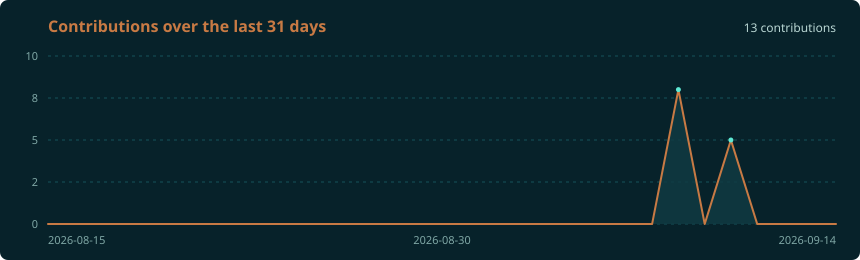

  

  
  
  

## Hello

I'm Domenico, a systems integrator and cloud architect with sysadmin roots. I spend my days making other people's infrastructure behave, and my evenings writing the tooling I wish had existed when I was doing it by hand.

**Coaxio** is where that tooling lives: a small ecosystem of open source projects for homelabs and proof-of-concept infrastructure.

I don't reimplement mature software. WireGuard, Caddy, and Authelia are already excellent; what's missing is the layer that wires them together on a bare host without a weekend of yak-shaving.

## What I'm building

| Project | What it does | State |
| --- | --- | --- |
| [**coaxio-forge**](https://github.com/Coaxio/coaxio-forge) | Day-zero scaffolding CLI: takes a bare Debian or Ubuntu host to a working homelab with WireGuard, Caddy, Authelia, and monitoring |  |
| [**coaxio.dev**](https://coaxio.dev) | The site: notes on what I break, and where the projects are documented |  |

## How I pick tools

Go for orchestrators, because config generation lives next to Caddy, Docker, and Kubernetes and the contributor barrier stays low. Rust when there's a daemon parsing untrusted bytes at speed, which is a real problem and not a fashion statement. Everything else is a judgement call I'm happy to argue about in an issue.

  
  
  
  
  
  
  
  
  
  
  
  

## Numbers

  
  

## Working notes

- Orchestrate mature tools, don't reimplement protocols.
- Document the limitation instead of hiding it. A `TODO` with the exact command beats a silent workaround.
- Validate a design as a mockup before it becomes a directory structure.
- Secrets stay host-local and encrypted with age. Coaxio is not going to be your vault.
- Every project is also a way to learn a language properly, so idiomatic beats clever.

## Get in touch

Issues and pull requests are the fastest route, on whichever repo the problem belongs to. Longer writing lives at [coaxio.dev](https://coaxio.dev). If you're running Coaxio tooling on something unusual, I'd like to hear how it broke.
